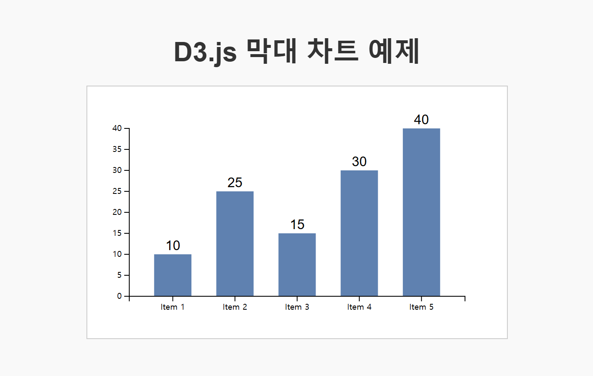

# GIS_Study
### D3.js와 chart.js를 활용한 데이터 시각화 실습 레포지터리
 

[skill]
JavaScript, HTML, CSS, D3.js

[학습 및 성장]
  ✅ 애니메이션 효과: 막대가 부드럽게 올라오도록 transition() 추가
  ✅ X/Y축 라벨: 데이터 값 표시, 축 추가
  ✅ 툴팁 (Hover 효과): 마우스를 올리면 값이 표시되도록 설정
  ✅ 스타일링 개선: 페이지를 더 깔끔하게 디자인

